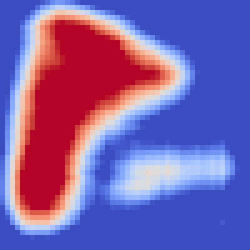

# Artificial Perceptual Learning (APL)

### Introduction

This repo includes the sample data and codes for the paper ***Large-scale, image-based tree species mapping in a tropical forest using artificial perceptual learning***.

**FIGURE 1.** Comparison between APL and infant categorization.

The above image illustrates the comparison between artificial perceptual learning (APL) and infant categorization. The proposed APL framework is constructed using state-of-the-art machine learning algorithms as building blocks that mimic the cognitive development process known as infant categorization.

### Implementation for case study

We used the APL framework to estimate the spatial distribution of three target species, the palm *Prestoea acuminata*, and the tree species *Cecropia schreberiana* and *Manilkara bidentata*, over a 5,000-hectare area of El Yunque National Forest.

 

**FIGURE 2.** Left: Location of El Yunque National Forest (EYNF) in Puerto Rico; Right: G-LiHT flight lines and location of the Luquillo Forest Dynamics Plot (LFDP) (yellow box).

The large-scale maps are based on unlabeled high-resolution aerial images of unsegmented trees. Misaligned ground-based labels, available for less than 1% of these images, serve as the only weak supervision. The whole workflow for the species distribution estimation is illustrated in Figure 3, with more details introduced in the paper.

**FIGURE 3.** Diagram for APL and basic workflow.

### Visualization for species distribution estimation 

   

   

**FIGURE 4.** Visualization of APL predictions over sample images. Left: *Prestoea acuminata*; Center: *Cecropia schreberiana*; Right: *Manilkara bidentata*. The color represents the estimated proportion covered by the target species (Blue: low, Red: high).

   

**FIGURE 5.** Visualization of APL predictions over EYNF. Upper Left: *Prestoea acuminata*; Upper Right: *Cecropia schreberiana*; Lower Left: *Manilkara bidentata*. The color represents the estimated proportion covered by the target species (Blue: low, Red: high).

## Folder Setup

- /data/: sample data used in the analysis.
- /doc/: IPython notebooks to reproduce the results.
- /figs/: figures used in the README.md.
- /libs/: function definitions.
- /output/: results of the analysis, generated by the codes in /doc/.

